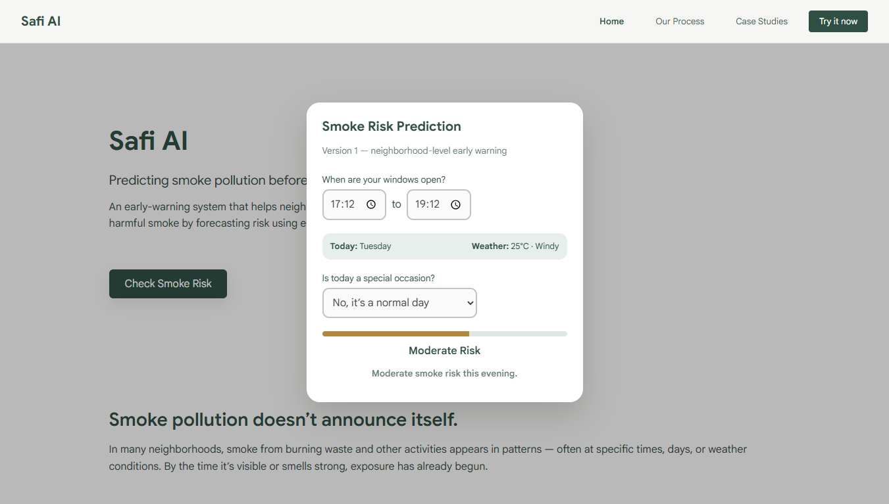

# Safi AI — Predictive Neighborhood Smoke Alert System

  

---

## Overview

**Safi AI** is a neighborhood-level predictive air-quality early warning system.  
It forecasts the probability of smoke pollution events in your area, allowing residents to make safer choices, such as when to open or close windows.

This project is a **working prototype** with a modern, responsive UI built with **React** and a **FastAPI** backend that serves predictions using a trained machine learning model.

---

## Features

- **Probabilistic Smoke Prediction**  
  Uses a machine learning pipeline to output the likelihood of smoke events instead of just binary labels.

- **Interactive User Interface**  
  Users input start and end times, specify whether it’s a special occasion, and receive predictions in a clean, responsive dashboard.

- **Automatic Contextual Data**  
  - Day of the week inferred from user location
  - Weather inferred from free APIs
  - Alerts generated based on configurable probability thresholds

- **Versioned & Scalable Backend**  
  FastAPI backend is modular and ready for future model updates (v2, v3) and advanced features.

- **Case Studies & Educational Flow**  
  Demonstrates the full lifecycle of Safi AI:
  - Data collection & preprocessing
  - Jupyter Notebook EDA
  - ML pipeline training
  - Backend integration
  - Frontend interface design

---

## Tech Stack

| Layer         | Technology / Library |
|---------------|--------------------|
| Frontend      | React, React Hooks, CSS Modules |
| Backend       | Python, FastAPI, Pydantic |
| Machine Learning | Python, scikit-learn, pandas, joblib |
| APIs          | Free weather API, Geolocation |
| Dev / Build   | Node.js, npm, Vite |

---

## Getting Started

### Prerequisites

- Python 3.10+
- Node.js 18+
- npm / yarn

### Backend Setup

```bash
cd backend
python -m venv venv
source venv/bin/activate   # Linux / Mac
venv\Scripts\activate      # Windows
pip install -r requirements.txt
uvicorn app.main:app --reload
